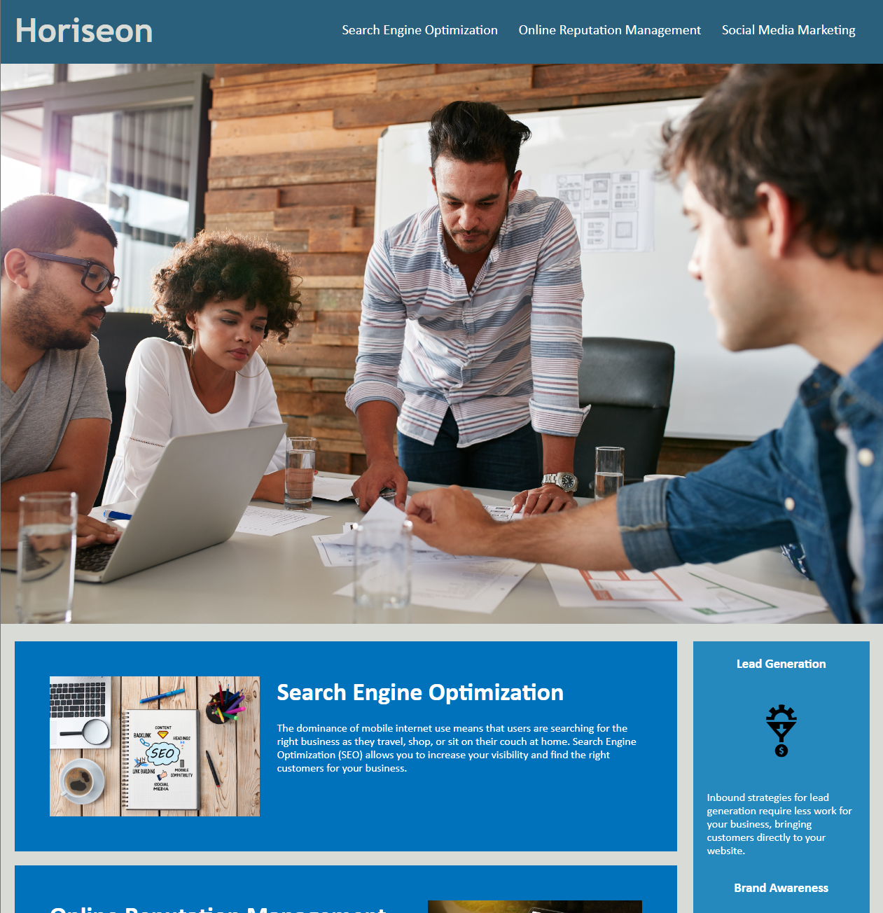

# Horiseon Project

This Project is an exercise in adhering code to accessibility standards so the site is optimized for search engines.

## Description

This Project explores how elements should be organized to meet accessibility standards. The source code has been modified so that it meets proper HTML semantics, alt-text for placeholders have been added to photo elements, links have been fixed so the navigation properly works and redirects to the correct segment, and both the HTML and CSS files have been reorganized to reduce redundancy and consolidate elements where possible to create a better and more efficient workspace.

## Image of Webpage

## License

MIT License

Copyright (c) 2022 Samuel Gerungan

Permission is hereby granted, free of charge, to any person obtaining a copy of this software and associated documentation files (the "Software"), to deal in the Software without restriction, including without limitation the rights to use, copy, modify, merge, publish, distribute, sublicense, and/or sell copies of the Software, and to permit persons to whom the Software is furnished to do so, subject to the following conditions:

The above copyright notice and this permission notice shall be included in all copies or substantial portions of the Software.

THE SOFTWARE IS PROVIDED "AS IS", WITHOUT WARRANTY OF ANY KIND, EXPRESS OR IMPLIED, INCLUDING BUT NOT LIMITED TO THE WARRANTIES OF MERCHANTABILITY, FITNESS FOR A PARTICULAR PURPOSE AND NONINFRINGEMENT. IN NO EVENT SHALL THE AUTHORS OR COPYRIGHT HOLDERS BE LIABLE FOR ANY CLAIM, DAMAGES OR OTHER LIABILITY, WHETHER IN AN ACTION OF CONTRACT, TORT OR OTHERWISE, ARISING FROM, OUT OF OR IN CONNECTION WITH THE SOFTWARE OR THE USE OR OTHER DEALINGS IN THE SOFTWARE.